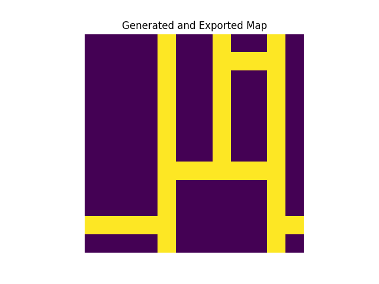
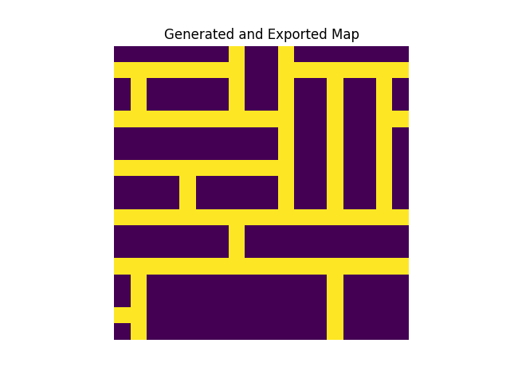
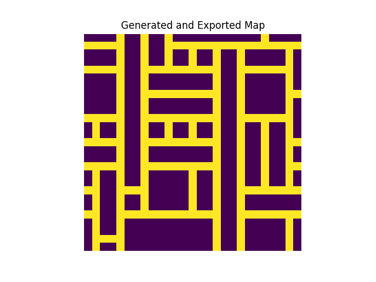
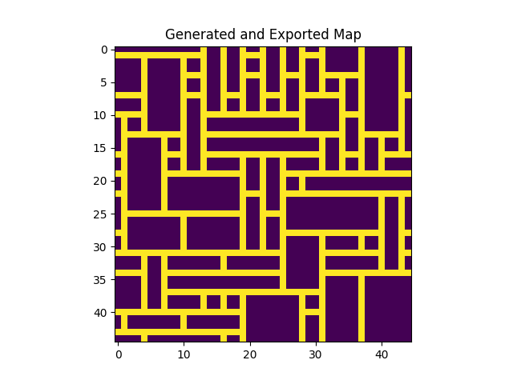

# Wave-Function-Collapse for Grid World Maze

The WFC was changed for a certain application. It creates a map for 2D world, the main result is a 2D binary matrix representing the walls and paths. It could be used in the environment to set the game. The repository with a game where this generator will be used - https://github.com/Nik-Kras/ToMnet-N

For details of each class and method please look at [`examples/Wave_Function_Collapse.ipynb`](examples/Wave_Function_Collapse.ipynb)

To look at the use examples - `main.py` or [`examples.py`](examples/examples.py)

PS: Yellow lines are path and Purple are walls

## virtual env

Use `poetry`.

## Testing

`poetry run pytest`

## Check code

`python -m vulture main.py src`

## Check the code again

`poetry run bandit -c pyproject.toml -r .`